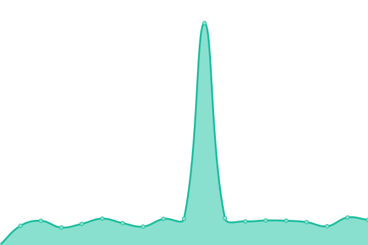
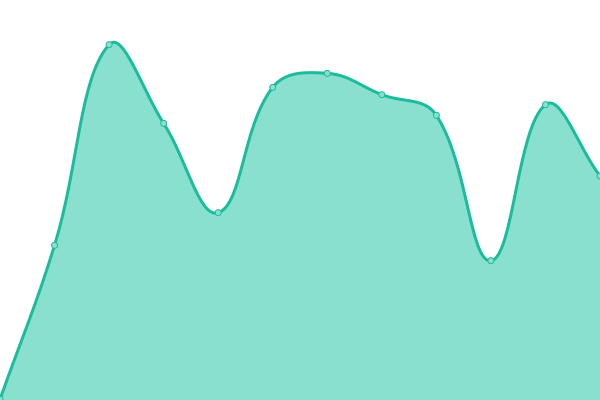
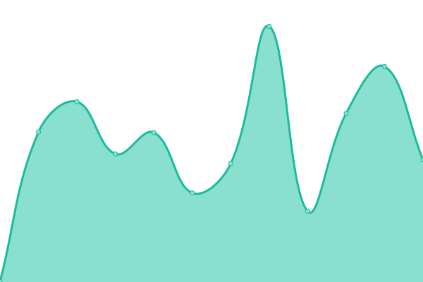

# [📈 Live Status](https://demo.upptime.js.org): <!--live status--> **🟧 Partial outage**

This repository contains the open-source uptime monitor and status page for [MAZ-Techno](https://demo.upptime.js.org), powered by [Upptime](https://github.com/upptime/upptime).

With [Upptime](https://upptime.js.org), you can get your own unlimited and free uptime monitor and status page, powered entirely by a GitHub repository. We use [Issues](https://github.com/MAZ-Techno/status-monitoring-maztech-work/issues) as incident reports, [Actions](https://github.com/MAZ-Techno/status-monitoring-maztech-work/actions) as uptime monitors, and [Pages](https://demo.upptime.js.org) for the status page.

<!--start: status pages-->
<!-- This summary is generated by Upptime (https://github.com/upptime/upptime) -->
<!-- Do not edit this manually, your changes will be overwritten -->
<!-- prettier-ignore -->
| URL | Status | History | Response Time | Uptime |
| --- | ------ | ------- | ------------- | ------ |
|  [Avicenne - LUX](https://avicenne.lu/) | 🟩 Up | [avicenne-lux.yml](https://github.com/MAZ-Techno/status-monitoring-maztech-work/commits/HEAD/history/avicenne-lux.yml) | 

 908ms
     
 | 

<a href="https://status.maz.ovh/history/avicenne-lux">100.00%</a>
    

|  [Mosaique - LUX](https://mosaiquelux.lu/) | 🟩 Up | [mosaique-lux.yml](https://github.com/MAZ-Techno/status-monitoring-maztech-work/commits/HEAD/history/mosaique-lux.yml) | 

 739ms
     
 | 

<a href="https://status.maz.ovh/history/mosaique-lux">99.82%</a>
    

|  [Iredi - LUX](https://iredi.lu/) | 🟩 Up | [iredi-lux.yml](https://github.com/MAZ-Techno/status-monitoring-maztech-work/commits/HEAD/history/iredi-lux.yml) | 

 694ms
     
 | 

<a href="https://status.maz.ovh/history/iredi-lux">100.00%</a>
    

|  [The knowledge venue - EGY](https://theknowledgevenue.com/) | 🟥 Down | [the-knowledge-venue-egy.yml](https://github.com/MAZ-Techno/status-monitoring-maztech-work/commits/HEAD/history/the-knowledge-venue-egy.yml) | 

 8320ms
     
 | 

<a href="https://status.maz.ovh/history/the-knowledge-venue-egy">94.99%</a>
    

|  [Luxembourg University Press - LUX](https://unipress.lu/) | 🟩 Up | [luxembourg-university-press-lux.yml](https://github.com/MAZ-Techno/status-monitoring-maztech-work/commits/HEAD/history/luxembourg-university-press-lux.yml) | 

 1373ms
     
 | 

<a href="https://status.maz.ovh/history/luxembourg-university-press-lux">99.90%</a>
    

|  [Luxor Library - LUX](https://luxorlibrary.lu/) | 🟩 Up | [luxor-library-lux.yml](https://github.com/MAZ-Techno/status-monitoring-maztech-work/commits/HEAD/history/luxor-library-lux.yml) | 

 1042ms
     
 | 

<a href="https://status.maz.ovh/history/luxor-library-lux">99.77%</a>
    

|  [Grocify Shop - LUX](https://grocify.lu/) | 🟥 Down | [grocify-shop-lux.yml](https://github.com/MAZ-Techno/status-monitoring-maztech-work/commits/HEAD/history/grocify-shop-lux.yml) | 

 3004ms
     
 | 

<a href="https://status.maz.ovh/history/grocify-shop-lux">93.80%</a>
    

|  [Luxy Tech - LUX](https://luxytech.lu/) | 🟩 Up | [luxy-tech-lux.yml](https://github.com/MAZ-Techno/status-monitoring-maztech-work/commits/HEAD/history/luxy-tech-lux.yml) | 

 286ms
     
 | 

<a href="https://status.maz.ovh/history/luxy-tech-lux">100.00%</a>
    

|  [Lissane School - LUX](https://lissane.lu/) | 🟩 Up | [lissane-school-lux.yml](https://github.com/MAZ-Techno/status-monitoring-maztech-work/commits/HEAD/history/lissane-school-lux.yml) | 

 1522ms
     
 | 

<a href="https://status.maz.ovh/history/lissane-school-lux">99.48%</a>
    

|  [AFMM Mosque - LUX](https://afmm.lu/) | 🟩 Up | [afmm-mosque-lux.yml](https://github.com/MAZ-Techno/status-monitoring-maztech-work/commits/HEAD/history/afmm-mosque-lux.yml) | 

 1182ms
     
 | 

<a href="https://status.maz.ovh/history/afmm-mosque-lux">96.96%</a>
    

|  [Manual Therapy Home - LUX](https://manualtherapyhome.com/) | 🟩 Up | [manual-therapy-home-lux.yml](https://github.com/MAZ-Techno/status-monitoring-maztech-work/commits/HEAD/history/manual-therapy-home-lux.yml) | 

 982ms
     
 | 

<a href="https://status.maz.ovh/history/manual-therapy-home-lux">96.99%</a>
    

|  [Joo & M Logistics - EGY](https://joo-m-logistics.com/) | 🟩 Up | [joo-and-m-logistics-egy.yml](https://github.com/MAZ-Techno/status-monitoring-maztech-work/commits/HEAD/history/joo-and-m-logistics-egy.yml) | 

 1030ms
     
 | 

<a href="https://status.maz.ovh/history/joo-and-m-logistics-egy">94.10%</a>
    

|  [Islam - Joo & M Logistics - EGY](https://islam.joo-m-logistics.com/) | 🟩 Up | [islam-joo-and-m-logistics-egy.yml](https://github.com/MAZ-Techno/status-monitoring-maztech-work/commits/HEAD/history/islam-joo-and-m-logistics-egy.yml) | 

 744ms
     
 | 

<a href="https://status.maz.ovh/history/islam-joo-and-m-logistics-egy">94.09%</a>
    

|  [SOPC RH - EGY](https://sopceg.com/) | 🟩 Up | [sopc-rh-egy.yml](https://github.com/MAZ-Techno/status-monitoring-maztech-work/commits/HEAD/history/sopc-rh-egy.yml) | 

 524ms
     
 | 

<a href="https://status.maz.ovh/history/sopc-rh-egy">100.00%</a>
    

|  [SUEZ PMC - EGY](https://suezpmc.com/) | 🟩 Up | [suez-pmc-egy.yml](https://github.com/MAZ-Techno/status-monitoring-maztech-work/commits/HEAD/history/suez-pmc-egy.yml) | 

 721ms
     
 | 

<a href="https://status.maz.ovh/history/suez-pmc-egy">100.00%</a>
    

|  [Portal SUEZ PMC - EGY](https://portal.suezpmc.com/) | 🟩 Up | [portal-suez-pmc-egy.yml](https://github.com/MAZ-Techno/status-monitoring-maztech-work/commits/HEAD/history/portal-suez-pmc-egy.yml) | 

 848ms
     
 | 

<a href="https://status.maz.ovh/history/portal-suez-pmc-egy">100.00%</a>
    

|  [Minaharis - EGY](https://minaharis.com/) | 🟩 Up | [minaharis-egy.yml](https://github.com/MAZ-Techno/status-monitoring-maztech-work/commits/HEAD/history/minaharis-egy.yml) | 

 561ms
     
 | 

<a href="https://status.maz.ovh/history/minaharis-egy">100.00%</a>
    

|  [Qasimi Realestate Develop - EGY](https://qasimidevelop.com) | 🟩 Up | [qasimi-realestate-develop-egy.yml](https://github.com/MAZ-Techno/status-monitoring-maztech-work/commits/HEAD/history/qasimi-realestate-develop-egy.yml) | 

 754ms
     
 | 

<a href="https://status.maz.ovh/history/qasimi-realestate-develop-egy">97.02%</a>
    

|  [Shabana Gold - EGY](http://app.shabanagold.com/) | 🟩 Up | [shabana-gold-egy.yml](https://github.com/MAZ-Techno/status-monitoring-maztech-work/commits/HEAD/history/shabana-gold-egy.yml) | 

 901ms
     
 | 

<a href="https://status.maz.ovh/history/shabana-gold-egy">100.00%</a>
    

|  [IPv6 Cloudflare DNS](one.one.one.one) | 🟩 Up | [i-pv6-cloudflare-dns.yml](https://github.com/MAZ-Techno/status-monitoring-maztech-work/commits/HEAD/history/i-pv6-cloudflare-dns.yml) | 

 6ms
     
 | 

<a href="https://status.maz.ovh/history/i-pv6-cloudflare-dns">100.00%</a>
    

|  [AquaLink - EGY (prod)](https://aqualink-clearance.com/) | 🟩 Up | [aqua-link-egy-prod.yml](https://github.com/MAZ-Techno/status-monitoring-maztech-work/commits/HEAD/history/aqua-link-egy-prod.yml) | 

 1274ms
     
 | 

<a href="https://status.maz.ovh/history/aqua-link-egy-prod">98.87%</a>
    

|  [Perfect Logistics - EGY (prod)](https://perfectlgs.com/) | 🟩 Up | [perfect-logistics-egy-prod.yml](https://github.com/MAZ-Techno/status-monitoring-maztech-work/commits/HEAD/history/perfect-logistics-egy-prod.yml) | 

 1043ms
     
 | 

<a href="https://status.maz.ovh/history/perfect-logistics-egy-prod">94.11%</a>
    

<!--end: status pages-->

[**Visit our status website →**](https://demo.upptime.js.org)

## 📄 License

- Powered by: [Upptime](https://github.com/upptime/upptime)
- Code: [MIT](./LICENSE) © [Anand Chowdhary](https://anandchowdhary.com), supported by [Pabio](https://pabio.com)
- Data in the `./history` directory: [Open Database License](https://opendatacommons.org/licenses/odbl/1-0/)
